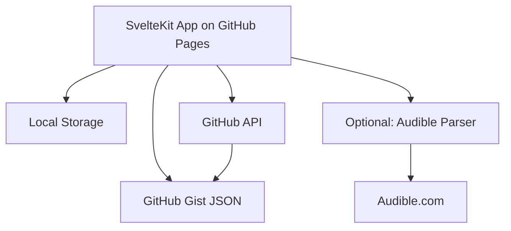

# Design Document

## Overview

The Audiobook Wishlist Manager is a personal web application built as a Progressive Web App (PWA) to ensure optimal performance on both iPhone 16 Plus and desktop computers. The application focuses on simplicity and essential functionality, providing a clean interface for managing audiobook wishlists with automatic data extraction from Audible links.

## Architecture

### High-Level Architecture



### Technology Stack

- **Framework**: SvelteKit with TypeScript
- **Styling**: DaisyUI + Tailwind CSS for component-based design
- **Data Storage**: GitHub Gist (single JSON file) for ultimate simplicity
- **Authentication**: GitHub Personal Access Token (stored locally)
- **Audible Parsing**: Client-side with CORS proxy (optional feature)
- **Deployment**: GitHub Pages for free static hosting
- **PWA**: Service worker for offline functionality

## Components and Interfaces

### Core Components

#### 1. Svelte Components

**BookList.svelte**
- Displays books in responsive grid/list layout
- Implements search, filter, and sort functionality
- Handles loading and empty states

**BookCard.svelte**
- Individual book display component
- Shows title, author, tags, narrator rating
- Quick actions (edit, delete, toggle "next" tag)

**BookForm.svelte**
- Add/edit book modal/page
- Audible link input with auto-parsing
- Tag selection and manual data entry

**TagFilter.svelte**
- Tag-based filtering interface
- Toggle multiple tags including "next"

#### 2. SvelteKit API Routes

**+page.server.js** (main page)
- Loads all books from database
- Handles server-side filtering for performance

**/api/books/+server.js**
- CRUD operations for books
- JSON import/export endpoints

**parseAudible.js** (client-side utility)
- Optional Audible URL parsing via CORS proxy
- Graceful fallback to manual entry
- Simple error logging for debugging

### Data Interfaces

```typescript
interface Book {
  id: string;
  title: string;
  author: string;
  audibleUrl?: string;
  tags: BookTag[];
  narratorRating?: number;
  dateAdded: Date;
  queuePosition?: number;
  coverImageUrl?: string;
  description?: string;
}

interface BookTag {
  id: string;
  name: 'funny' | 'action' | 'series' | 'standalone' | 'thriller' | 'next';
  color: string;
}

interface WishlistState {
  books: Book[];
  filters: FilterState;
  syncStatus: 'synced' | 'syncing' | 'offline' | 'error';
}
```

## Data Models

### Data Structure (Single JSON File)

```json
{
  "books": [
    {
      "id": "unique-id",
      "title": "Book Title",
      "author": "Author Name",
      "audibleUrl": "https://audible.com/...",
      "narratorRating": 4.5,
      "description": "Book description",
      "coverImageUrl": "https://...",
      "tags": ["funny", "series", "next"],
      "dateAdded": "2025-09-12T10:30:00Z"
    }
  ],

  "lastUpdated": "2025-09-12T10:30:00Z"
}
```

### Data Persistence Strategy

1. **Primary Storage**: GitHub Gist (single JSON file)
2. **Local Cache**: Browser localStorage for offline access
3. **Sync**: GitHub API to read/write the Gist
4. **Backup**: Automatic via GitHub's version history
5. **Import/Export**: Direct JSON file download/upload

## Error Handling

### Audible Parsing Errors
- **Network Issues**: Retry with exponential backoff
- **Parsing Failures**: Fall back to manual entry
- **Rate Limiting**: Queue requests and respect limits
- **Invalid URLs**: Provide clear error messages

### Sync Errors
- **Network Connectivity**: Queue changes for later sync
- **Authentication Issues**: Prompt for re-authentication
- **Conflict Resolution**: Show merge interface for conflicts
- **Storage Limits**: Implement data cleanup strategies

### User Experience Errors
- **Loading States**: Show skeleton screens and progress indicators
- **Empty States**: Provide helpful onboarding messages
- **Validation Errors**: Inline validation with clear messaging

## Testing Strategy

### Unit Testing
- **Data Models**: Validate book and tag operations
- **Sync Logic**: Test conflict resolution and data integrity
- **Parser Service**: Mock Audible responses and test extraction
- **Filter/Search**: Verify query logic and performance

### Integration Testing
- **End-to-End Flows**: Add book → tag → queue → sync
- **Cross-Device Sync**: Test data consistency across devices
- **Offline Functionality**: Verify offline-to-online transitions
- **Responsive Design**: Test on target devices (iPhone 16 Plus, desktop)

### Error Logging
- **Console Logging**: Simple console.log for development
- **Error Tracking**: Log errors to localStorage for debugging
- **User Feedback**: Show friendly error messages in UI

## Security Considerations

### Data Privacy
- **Local-First**: Sensitive data stays on device when possible
- **Encryption**: Encrypt data in transit and at rest
- **Authentication**: Secure user authentication for cloud sync
- **Minimal Data**: Only collect necessary information

### Audible Scraping Ethics
- **Rate Limiting**: Respect Audible's servers with reasonable delays
- **Caching**: Cache results to minimize requests
- **User-Agent**: Identify as personal use application
- **Fallback**: Always provide manual entry option

## Deployment Architecture

### Static Site Deployment
- **GitHub Pages**: Free static site hosting
- **PWA Manifest**: Enable "Add to Home Screen" functionality
- **Service Worker**: Cache resources for offline use
- **GitHub CDN**: Automatic global content delivery

### Data & Services
- **GitHub Gist**: JSON data storage with version history
- **GitHub API**: Read/write access to Gist data
- **Personal Access Token**: Simple authentication
- **Browser Storage**: Local caching and offline support