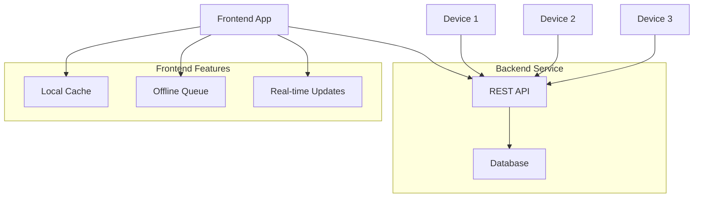

# Design Document

## Overview

This design outlines the migration from GitHub Gist-based sync to a proper database backend with REST API. The solution will use a simple, lightweight backend service with a SQL database for reliable data storage and real-time synchronization across devices.

## Architecture

### High-Level Architecture



### Technology Stack

**Backend:**
- **Runtime**: SvelteKit API routes (built-in full-stack capabilities)
- **Database**: SQLite (simple, file-based, no setup required)
- **ORM**: Drizzle ORM (lightweight, TypeScript-first)
- **Hosting**: Railway (deploy entire SvelteKit app)

**Frontend Changes:**
- Replace GitHub sync service with API client
- Add offline caching with IndexedDB
- Implement optimistic updates for better UX

## Components and Interfaces

### Database Schema (Drizzle)

```typescript
// schema.ts
import { sqliteTable, text, real, integer } from 'drizzle-orm/sqlite-core';
import { relations } from 'drizzle-orm';

export const books = sqliteTable('books', {
  id: text('id').primaryKey(),
  title: text('title').notNull(),
  author: text('author').notNull(),
  audibleUrl: text('audible_url'),
  narratorRating: real('narrator_rating'),
  performanceRating: real('performance_rating'),
  description: text('description'),
  coverImageUrl: text('cover_image_url'),
  queuePosition: integer('queue_position'),
  dateAdded: text('date_added').notNull(),
  dateUpdated: text('date_updated').notNull(),
  createdAt: text('created_at').notNull(),
  updatedAt: text('updated_at').notNull(),
});

export const tags = sqliteTable('tags', {
  id: text('id').primaryKey(),
  name: text('name').notNull().unique(),
  color: text('color').notNull(),
  createdAt: text('created_at').notNull(),
});

export const bookTags = sqliteTable('book_tags', {
  bookId: text('book_id').references(() => books.id, { onDelete: 'cascade' }),
  tagId: text('tag_id').references(() => tags.id, { onDelete: 'cascade' }),
}, (table) => ({
  pk: primaryKey({ columns: [table.bookId, table.tagId] }),
}));

// Relations
export const booksRelations = relations(books, ({ many }) => ({
  bookTags: many(bookTags),
}));

export const tagsRelations = relations(tags, ({ many }) => ({
  bookTags: many(bookTags),
}));

export const bookTagsRelations = relations(bookTags, ({ one }) => ({
  book: one(books, { fields: [bookTags.bookId], references: [books.id] }),
  tag: one(tags, { fields: [bookTags.tagId], references: [tags.id] }),
}));
```

### SvelteKit API Routes

```typescript
// src/routes/api/books/+server.ts
GET    /api/books              // Get all books
POST   /api/books              // Create new book

// src/routes/api/books/[id]/+server.ts  
GET    /api/books/[id]         // Get specific book
PUT    /api/books/[id]         // Update book
DELETE /api/books/[id]         // Delete book

// src/routes/api/tags/+server.ts
GET    /api/tags               // Get all tags
POST   /api/tags               // Create new tag

// src/routes/api/migrate/github/+server.ts
POST   /api/migrate/github     // Import from GitHub gist

// src/routes/api/migrate/status/+server.ts
GET    /api/migrate/status     // Check migration status
```

### Frontend API Client

```typescript
class ApiClient {
    async getBooks(): Promise<Book[]>
    async createBook(book: CreateBookInput): Promise<Book>
    async updateBook(id: string, updates: UpdateBookInput): Promise<Book>
    async deleteBook(id: string): Promise<void>
    async getTags(): Promise<Tag[]>
}
```

### Offline Support

```typescript
class OfflineManager {
    // Cache management
    async cacheBooks(books: Book[]): Promise<void>
    async getCachedBooks(): Promise<Book[]>
    
    // Offline queue
    async queueOperation(operation: OfflineOperation): Promise<void>
    async syncOfflineOperations(): Promise<void>
}
```

## Data Models

### Book Model (Updated)

```typescript
interface Book {
    id: string;
    title: string;
    author: string;
    audibleUrl?: string;
    narratorRating?: number;
    performanceRating?: number;
    description?: string;
    coverImageUrl?: string;
    queuePosition?: number;
    tags: Tag[];
    dateAdded: string;
    dateUpdated: string;
    createdAt: string;
    updatedAt: string;
}
```

### API Response Models

```typescript
interface ApiResponse<T> {
    success: boolean;
    data?: T;
    error?: string;
    message?: string;
}

interface BooksResponse extends ApiResponse<Book[]> {}
interface BookResponse extends ApiResponse<Book> {}
```

## Error Handling

### API Error Responses

```typescript
interface ApiError {
    status: number;
    code: string;
    message: string;
    details?: any;
}

// Common error codes
const ErrorCodes = {
    BOOK_NOT_FOUND: 'BOOK_NOT_FOUND',
    VALIDATION_ERROR: 'VALIDATION_ERROR',
    DATABASE_ERROR: 'DATABASE_ERROR',
    NETWORK_ERROR: 'NETWORK_ERROR'
} as const;
```

### Frontend Error Handling

- **Network errors**: Show offline mode, queue operations
- **Validation errors**: Show field-specific error messages
- **Server errors**: Show retry options with exponential backoff
- **Offline mode**: Show cached data with sync status

## Testing Strategy

### Backend Testing

1. **Unit Tests**
   - Database operations (CRUD)
   - API endpoint handlers
   - Data validation logic
   - Migration functions

2. **Integration Tests**
   - Full API request/response cycles
   - Database transactions
   - Error handling scenarios

### Frontend Testing

1. **Unit Tests**
   - API client methods
   - Offline queue operations
   - Cache management
   - Error handling

2. **Integration Tests**
   - End-to-end user workflows
   - Offline/online transitions
   - Multi-device sync scenarios

## Migration Strategy

### Phase 1: Backend Setup
1. Create backend service with database
2. Implement REST API endpoints
3. Add GitHub gist import functionality
4. Deploy backend service

### Phase 2: Frontend Migration
1. Create new API client service
2. Replace GitHub sync calls with API calls
3. Add offline caching layer
4. Update error handling

### Phase 3: Data Migration
1. Import existing GitHub gist data
2. Verify data integrity
3. Switch frontend to use database
4. Remove GitHub sync code

### Phase 4: Enhancements
1. Add real-time updates (WebSocket/SSE)
2. Implement advanced offline support
3. Add data export/backup features
4. Performance optimizations

## Implementation Considerations

### Simplicity First
- Start with SQLite (can upgrade to PostgreSQL later)
- Use proven, simple technologies
- Minimize external dependencies
- Focus on core functionality first

### Performance
- Add database indexes for common queries
- Implement pagination for large datasets
- Use connection pooling
- Add response caching where appropriate

### Security
- Input validation and sanitization
- Rate limiting on API endpoints
- CORS configuration
- Basic authentication (can add OAuth later)

### Scalability
- Design for horizontal scaling
- Use stateless API design
- Implement proper logging
- Add health check endpoints