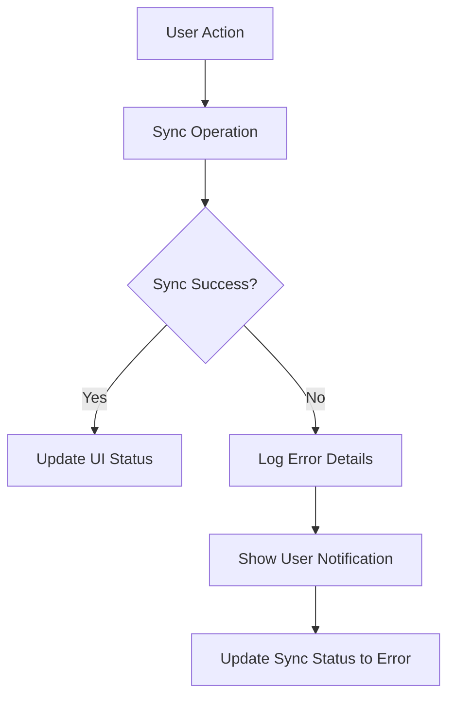

# Design Document

## Overview

This design addresses the GitHub sync error handling improvements for the audiobook wishlist manager. The solution focuses on simple, effective error logging and user notifications when GitHub sync operations fail. The approach enhances the existing error logging system without adding complex interfaces or abstractions.

## Architecture

### Simple Error Handling Flow

## Components and Interfaces

### Enhanced Error Logging

The existing `ErrorLogger` service will be enhanced to capture more detailed GitHub sync errors:

- Log HTTP status codes and response bodies
- Include GitHub API endpoint information
- Capture network error details
- Log authentication and permission errors

### Enhanced User Notifications

The existing notification system will be improved to show specific sync error messages:

- Display clear error descriptions instead of generic "sync failed" messages
- Show different messages for different error types (network, auth, server)
- Include actionable guidance when possible

### Simple Sync Status Updates

The existing sync status indicator will be enhanced to:

- Show specific error states
- Display the last error message
- Provide a simple retry mechanism

### UI Data Synchronization

The main wishlist page will be enhanced to properly handle sync result data:

- Update the books array when sync operations return newer data
- Refresh the UI when remote data is more recent than local data
- Handle data updates from both automatic and manual sync operations

## Error Handling

### Simple Error Processing

1. **Error Capture**: All GitHub API errors are caught and logged with full details
2. **Error Logging**: Log HTTP status, response body, and operation context
3. **User Notification**: Show specific error messages instead of generic failures
4. **Status Update**: Update sync status to reflect the specific error state

### Error Message Improvements

Instead of generic "sync failed" messages, show specific errors like:

- "GitHub authentication failed - check your token"
- "Network connection error - check your internet"
- "GitHub server error - try again later"
- "Rate limited - wait before retrying"

## Testing Strategy

### Unit Tests

1. **Error Logging Tests**
   - Test that GitHub API errors are properly logged with details
   - Verify error messages are user-friendly
   - Test that sensitive data is excluded from logs

2. **Notification Tests**
   - Test that specific error messages are shown to users
   - Verify notifications appear for different error types
   - Test notification dismissal and persistence

### Integration Tests

1. **Sync Error Scenarios**
   - Mock GitHub API failures and verify error handling
   - Test network error scenarios
   - Test authentication error scenarios

## Implementation Considerations

### Simple Approach
- Enhance existing error logging without new abstractions
- Improve existing notification system
- Keep changes minimal and focused

### Security
- Exclude GitHub tokens from error logs
- Don't expose internal system details in user messages